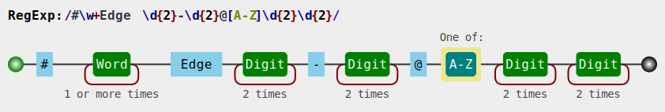

# 总览
后现代主义科幻，有尼采哲学成分。

!!! quote ""
    <big><center>每一个不曾起舞的日子，都是对生命的辜负。</center></big>
    <center>——Friedrich Wilhelm Nietzsche(1844-1900)</center>
---
## 世界名
[没想好]

---
## 纪年方法：RE纪年法
灵感来自于各大信奥赛在线评测平台的那一句<span style="color: rgb(157, 61, 207);">*Runtime Error!(RE)*</span>。
!!! failure "Runtime Error"
    ~~ld returned 3 exit status~~

本质上与公元纪年法（AD）无差别（把AD换成了RE而已）。  

---
## 经济
基础货币：“咕(Gu)”。  
灵感来自于[洛谷的咕值](https://www.luogu.com.cn/discuss/83952)。

---
## 地址
```
Example:
#Cloudier Edge 30-01@A0158
#<Road/Edge Name> <RdId>@<ZoneID><SubZoneID><BlockID>
```

=== "Road/Edge Name"
    ``` ruby
    #Cloudier Edge 30-01@A0158
    -^^^^^^^^^^^^^------------
    道路名称。
    在这个世界里，“路”被叫做“边”(Edge)。
    不是那个浏览器！！！
    ```
=== "RdId"
    ``` ruby
    #Cloudier Edge 30-01@A0158
    ---------------^^^^^------
    类似于真实地址中的xx号附xx号。
    由两个两位数组成，以'-'连接。
    格式为xx-xx。不足两位前面补0。
    ```
=== "ZoneID"
    ``` ruby
    #Cloudier Edge 30-01@A0158
    ---------------------^----
    一个大写英文字母，代表地址所在的地区。（省）
    ```
=== "SubZoneID"
    ``` ruby
    #Cloudier Edge 30-01@A0158
    ----------------------^^--
    一个两位数，代表地址所在的子区。（市）
    ```
=== "BlockID"
    ``` ruby
    #Cloudier Edge 30-01@A0158
    ------------------------^^
    一个两位数，代表地址所在的块(Block)。（区）
    ```

给地址用的正则表达式：
``` javascript
#\w+ Edge \d{2}-\d{2}@[A-Z]\d{2}\d{2}
```


---
## 交通
### 可移动式解决方案 
[待补充]


---
## 其他杂乱的信息
1. 这里的有限公司被称作“工作组 (Working Team)”。
2. 这个世界主张地平说。